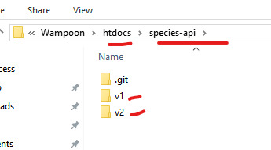

import { Steps} from '@astrojs/starlight/components';

## What is REST API Versioning?

API versioning allows you to make changes to your API without breaking existing clients. Clients using `v1` continue to work while you develop new features in `v2`.

We'll use **URI versioning**, the most straightforward approach where the version is part of the URI path.

## Steps to Version Your REST API

:::caution[Important]
1. Only **one team member** should perform the versioning setup to avoid merge conflicts or duplicated work.
2. Do not copy the `.git` folder into `v1` or `v2`. Keep the `.git` folder in the root of your web service (aka your slim application).
:::

<Steps>  

1. Create two subdirectories in your web service's root folder: `v1` and `v2`.

2. Copy all files from your root web service folder into both `v1` and `v2` (as shown in the screenshot below).

4. Update the `constants.php` file in both `v1` and `v2` directories. 
   1. Open `v1/config/constants.php`
   1. Locate this line: `define('APP_ROOT_DIR', basename(dirname(__FILE__, 2)));`
   2. Replace it with: `define('APP_ROOT_DIR', basename(dirname(__FILE__, 3)) . '/' . basename(dirname(__FILE__, 2)));`
   4. Save the file
   5. Repeat steps 1-4 for `v2/config/constants.php`
   6. Test your routes (e.g., access /your-api/v1/ping in the browser/Thunder Client)

3. Clients can now call a particular API version using the versioned base URI:
   - `localhost/species-api/v1`
   - `localhost/species-api/v2`

4. Commit and push all updates to GitHub remote repository.

</Steps>

And that's it! Your REST API now supports multiple versions via URI versioning.
