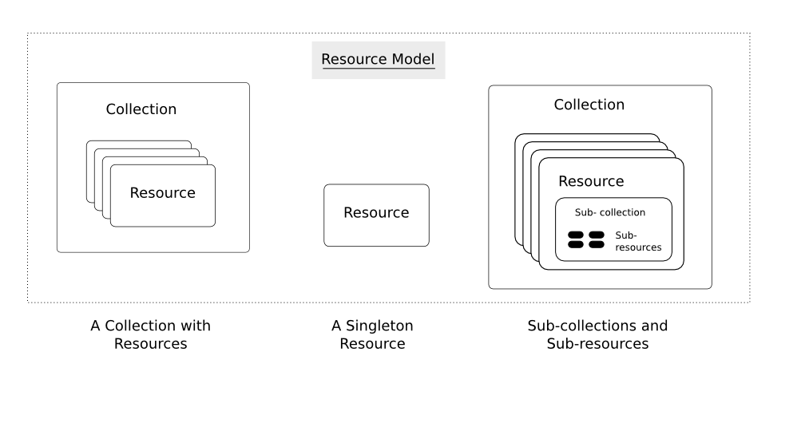

## What is REST?

**REST (Representational State Transfer)** is an architectural style for building web services that leverages the existing infrastructure and protocols of the World Wide Web. Introduced by Roy Fielding in 2000, REST defines a set of constraints that, when applied, create scalable, maintainable, and performant web services.

### Core REST Principles

1. **Client-Server Architecture**: Clear separation between client and server responsibilities
2. **Stateless**: Each request contains all information needed to process it
3. **Cacheable**: Responses should be explicitly marked as cacheable or non-cacheable
4. **Uniform Interface**: Standard methods and consistent resource identification
5. **Layered System**: Architecture can include intermediate layers (proxies, gateways)
6. **Code on Demand** (optional): Server can send executable code to extend client functionality

### Why REST Became Popular

- **Simplicity**: Uses familiar HTTP methods and status codes
- **Scalability**: Stateless nature enables horizontal scaling
- **Flexibility**: Works with any data format (JSON, XML, HTML)
- **Web-friendly**: Leverages existing web infrastructure
- **Discoverability**: Resources are self-descriptive through URIs

:::tip[Key Insight]
REST isn't a technology or protocol - it's an **architectural style** that guides how you design web services to be simple, scalable, and maintainable.
:::

---

## Resources in REST

The fundamental concept in any RESTful API is the ***resource***. One of the first steps in developing a RESTful Web service is designing the **resource model**.
The resource model identifies and classifies all the resources the client uses to interact with the service.

:::tip
**Design your API with the API consumer in mind!**
:::

Each resource MUST make sense from the perspective of the API consumer.
Beware of simply copying your internal model. Do not leak irrelevant implementation details out to your API.

## What Is a Resource?

**A resource is simply a "thing" that your application manages** - any piece of data or functionality that clients need to interact with. Think of resources as the **nouns** in your system.

---

### Examples of Resources

Instead of thinking abstractly, let's look at concrete examples:

**E-commerce System:**
- **Product** - A specific item for sale (iPhone, laptop, book)
- **User** - A customer account
- **Order** - A purchase transaction
- **Cart** - A shopping cart containing items

**Social Media Platform:**
- **User** - A person's profile
- **Post** - A status update, photo, or article
- **Comment** - A response to a post
- **Like** - A user's approval of content

**Planetary Database:**
- **Planet** - A celestial body (Earth, Mars, Jupiter)
- **Moon** - A natural satellite
- **Star** - The central star of a solar system

### Resource Identification with URLs

Each resource gets a **unique URL** that identifies it:

```http
GET /api/planets/123        # Planet with ID 123
GET /api/users/456          # User with ID 456
GET /api/orders/789         # Order with ID 789
```

**Key insight**: The URL tells you **what** (the resource), and the HTTP verb tells you **what to do** with it.

---

## Resource Types

### 1. Individual Resources

A **single, specific instance** of something:

```http
GET /api/planets/earth      # The Earth specifically
GET /api/users/john-doe     # John Doe's profile
GET /api/orders/12345       # Order number 12345
```

**Characteristics:**
- Represents **one specific thing**
- Has **unique identifier** (ID, name, etc.)
- Contains **detailed information** about that thing

### 2. Collection Resources

A **group of related resources** of the same type:

```http
GET /api/planets           # All planets
GET /api/users             # All users  
GET /api/orders            # All orders
```

**Characteristics:**
- Contains **multiple resources** of the same type
- Usually returns a **list or array**
- Supports operations like **create new items**

:::tip[Collections are Resources Too!]
The collection itself is a resource - you can GET it, and often POST to it to create new items.
:::

### 3. Sub-Collections

Collections that **belong to** a parent resource:

```http
GET /api/planets/123/moons     # All moons of planet 123
GET /api/users/456/orders      # All orders by user 456
GET /api/orders/789/items      # All items in order 789
```

**Why use sub-collections?**
- Express **relationships** between resources
- Show **ownership** or **containment**
- Provide **scoped access** to related data

---

## Resource-Oriented Thinking

### Before: RPC-Style (Action-Oriented)
```http
POST /api/getPlanet          # What action to perform
POST /api/createUser
POST /api/updateOrder
POST /api/deleteProduct
```

**Focus**: What **functions** can I call?

### After: REST-Style (Resource-Oriented)
```http
GET    /api/planets/123      # What thing to work with
POST   /api/users            # HTTP verb says what to do
PUT    /api/orders/456
DELETE /api/products/789
```

**Focus**: What **things** does my system have?

### The Mental Shift

**Ask yourself:**
1. **What are the "things" in my system?** (Resources)
2. **How are these things related?** (Sub-resources, relationships)
3. **What operations make sense on each thing?** (HTTP verbs)

**Don't ask:**
- "What functions should I expose?"
- "What can users do?"

---

## Designing Your Resource Model

### Step 1: Identify Your Resources

**Look at your system and find the nouns:**

*"Users can view planets, add planets to favorites, and see details about each planet's moons."*

**Resources identified:**
- `User` (person using the system)
- `Planet` (celestial body)
- `Favorite` (user's saved planets)
- `Moon` (satellite of a planet)

### Step 2: Determine Resource Relationships

```
User
├── /favorites (sub-collection of user's favorite planets)
└── /profile (singleton - user's profile info)

Planet  
├── /moons (sub-collection of planet's moons)
└── /atmosphere (singleton - atmospheric data)

Moon (belongs to a planet)
```

### Step 3: Map to URLs

```http
# Users
GET /api/users                    # All users
GET /api/users/123                # Specific user
GET /api/users/123/favorites      # User's favorite planets
GET /api/users/123/profile        # User's profile

# Planets  
GET /api/planets                  # All planets
GET /api/planets/earth            # Earth specifically  
GET /api/planets/earth/moons      # Earth's moons
GET /api/planets/earth/atmosphere # Earth's atmosphere

# Moons (as sub-resources)
GET /api/planets/earth/moons/luna # Earth's moon Luna
```

---

## Common Resource Design Patterns

### 1. Hierarchical Resources
```http
/api/universities/123/departments/456/courses/789
```
**When to use**: Clear ownership/containment relationships

### 2. Flat Resources with References
```http
/api/courses/789
Response: {
  "id": 789,
  "name": "Computer Science 101",
  "department_id": 456,
  "university_id": 123
}
```
**When to use**: Resources can exist independently

### 3. Singleton Resources
```http
/api/users/123/profile       # User only has one profile
/api/planets/earth/core      # Planet only has one core
```
**When to use**: One-to-one relationships, settings, configurations

## The Resource Model

---

The diagram below illustrates the aforementioned concepts of in a RESTful API.



We call information that describes available resources types, their behavior, and their relationships the **resource model** of an API. The resource model can be viewed as the RESTful mapping of the application data model.

Find more details in the chapters:

- [Collection Resources](../collection-resources)
- [Filtering, sorting, field selection and paging](../filtering-sorting-field-selection-and-paging/filtering-sorting-field-selection-and-paging.md)
