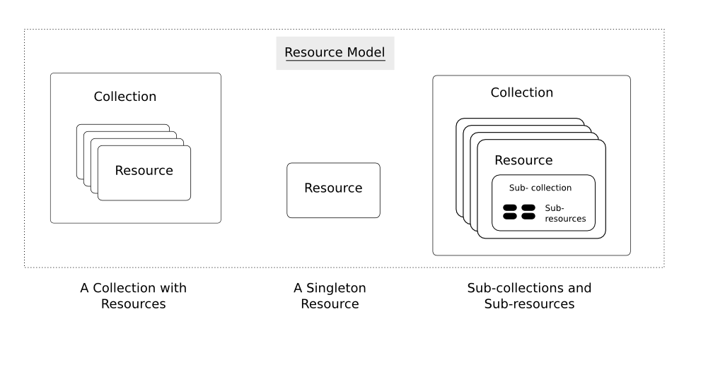

## Resources in REST

---

The fundamental concept in any RESTful API is the ***resource***. One of the first steps in developing a RESTful Web service is designing the **resource model**.
The resource model identifies and classifies all the resources the client uses to interact with the service.

:::tip
**Design your API with the API consumer in mind!**
:::

Each resource MUST make sense from the perspective of the API consumer.
Beware of simply copying your internal model. Do not leak irrelevant implementation details out to your API.

## What Is a Resource?

---

A ***resource*** is an object with a type, associated data, relationships to other resources, and a set of methods that operate on it. HTTP **verbs** (such as GET, POST, PUT, DELETE) are used to manipulate the resources.

Resources can be grouped into ***collections***. Each collection is homogeneous so that it contains only one type of resource, and unordered. Resources can also exist outside any collection. In this case, we refer to these resources as ***singleton*** resources. 

:::note
Collections are themselves resources as well.
:::

Collections can exist globally at the top level of an API, but can also be contained inside a single resource. In the latter case, we refer to these collections as **sub-collections**.

 Sub-collections are usually used to express some kind of "contained in" relationship. For more details on this, refer to the [Relationships and Sub-Resources](../relationships-and-sub-resources) page.

## The Resource Model

---

The diagram below illustrates the aforementioned concepts of in a RESTful API.

We call information that describes available resources types, their behavior, and their relationships the **resource model** of an API. The resource model can be viewed as the RESTful mapping of the application data model.

Find more details in the chapters:

- [Collection Resources](../collection-resources)
- [Filtering, sorting, field selection and paging](../filtering-sorting-field-selection-and-paging/filtering-sorting-field-selection-and-paging.md)
